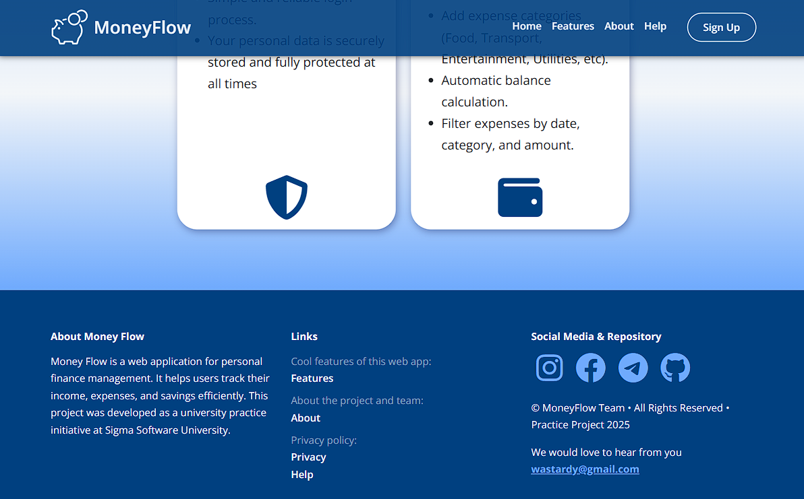
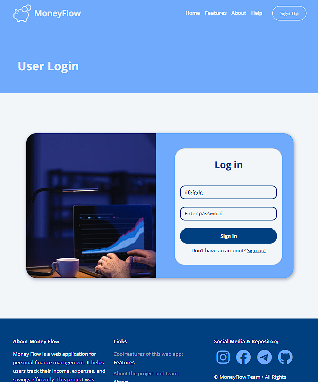
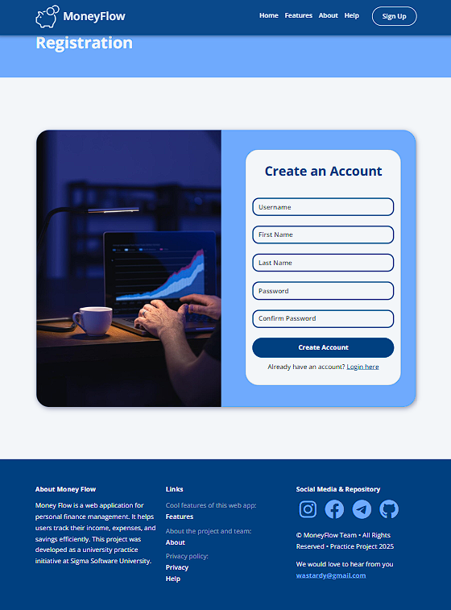

# MoneyFlow - Personal Finance Manager

MoneyFlow is a comprehensive web application for personal finance management. It helps users track their income, expenses, and savings efficiently. This project was developed as a university practice initiative at Sigma Software University.

## Features

- **User-friendly Interface**: Intuitive design for easy financial management
- **Comprehensive Tracking**: Monitor income, expenses, and savings in one place
- **Goal-Oriented Planning**: Set and track financial goals with personalized recommendations
- **Secure & Private**: Advanced encryption to protect your financial data

## Installation

1. Clone this repository:

```bash
git clone https://github.com/yourusername/moneyflow.git
cd moneyflow
```

2. Install dependencies:

```bash
npm install
```

This will install Bootstrap, Sass and Font Awesome.

## Compile Sass

To build your CSS files from Sass, run:

```bash
npm run sass:build
```

## Watch Sass

To watch your Sass files for changes, run:

```bash
npm run sass:watch
```

To customize, add the Bootstrap variables to the `bootstrap.scss` file.
You can look at the file `node_modules/bootstrap/dist/scss/_variables.scss`
for a list of all the variables. Do NOT edit the `variables.scss` file
directly, as it will be overwritten when you update Bootstrap.

To add your own custom styles, use the `styles.scss` file.

## Project Structure

```
moneyflow/
├── assets/             # Static assets
│   ├── icons/          # Application icons
│   ├── images/         # Images used throughout the site
│   └── webfonts/       # Font files
├── css/                # Compiled CSS files
├── js/                 # JavaScript files
├── scss/               # Sass source files
├── index.html          # Main entry point
├── package.json        # Project dependencies
└── readme.md           # This documentation
```

## Application Screenshots

### Home Page




### Login Page



### Registration Page



## About


### Help Section


---

> MoneyFlow is a web application designed to help individuals take control of their personal finances. With a user-friendly interface, it allows you to track your income, expenses, and savings all in one place. Whether you're budgeting for the month or planning for long-term financial goals, MoneyFlow provides the tools to make informed decisions about your finances.

## Contact

We would love to hear from you!

Email: wastardy.k@gmail.com

## License

© MoneyFlow Team • All Rights Reserved • Practice Project 2025
